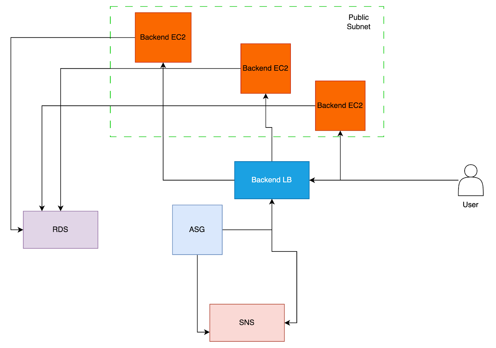

# **Terraform Infrastructure for ECommerce Website**

_This repository contains the Terraform configuration files for deploying a full-fledged eCommerce web application built using Django. The infrastructure is designed to be scalable, secure, and cost-efficient, leveraging AWS services to ensure high availability and performance._

---


## **Architecture**



## **Prerequisites**

- **Terraform**: Installed on your local machine (Version ≥ 1.0.0).  
- **AWS CLI**: Configured with appropriate permissions.  
- **Django Application**: Available and ready for deployment.  
- **Backend State**: Configured for Terraform state management (e.g., S3 bucket with DynamoDB).  

---

## **Usage**

1. **Clone the Repository**:
   ```bash
   git clone https://github.com/juniemariam/terraform-ecommerce-aws-hosting.git
   cd terraform-ecommerce-aws-hosting
2. **Initialize Terraform**:
   ```bash
   terraform init
3. **Plan the Infrastructure**:
   ```bash
   terraform plan

4. **Apply the configuration**:
   ```bash
   terraform apply
   ```
   
## **Output**


## **Refer Document for more info**
I have provided a document which gives the screenshots of all the services that the terraform has built. You can check it [here](https://github.com/juniemariam/terraform-ecommerce-aws-hosting/blob/main/Design%20Implementation.pdf)

